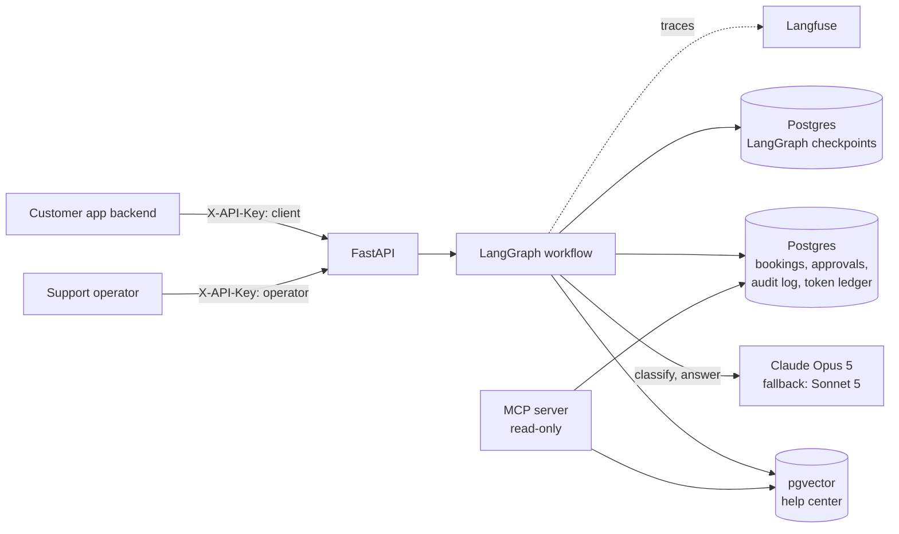
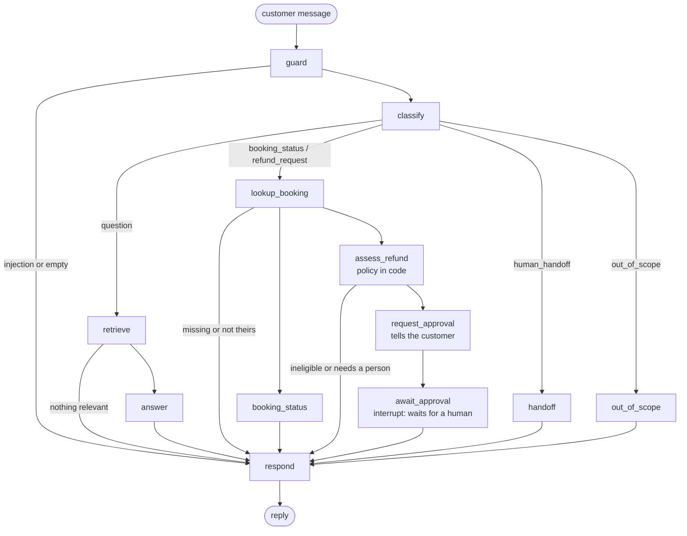

# Concierge

A customer support agent built the way you would run one in production: a **LangGraph** workflow over **Claude**, retrieval on **Postgres + pgvector**, **human approval before any money moves**, and **evals that gate CI**.

The demo company is *Tidewell Home Services*, a fictional home cleaning and repair business with a help center, bookings, and a refund policy.

```
Customer:  Please cancel BK-1042 and refund me
Concierge: I've sent a refund request of $240.00 for booking BK-1042 to our support team
           for approval. You'll get a confirmation here once it's reviewed.

(a support lead approves it in the operator API)

Concierge: Your refund of $240.00 for booking BK-1042 has been approved. It will appear on
           your original payment method within 5 to 10 business days.
```

## Results at a glance

Measured on 2026-09-13 with Claude Opus 5. Raw output is in [`evals/results/`](evals/results).

| | |
|---|---|
| End-to-end agent eval | **30 / 31 cases (96.8%)** |
| Safety cases (prompt injection, other customers' bookings, fake "admin" authority) | **7 / 7** |
| Refunds executed without a human decision | **0** |
| Cost per conversation | **$0.0085** |
| Turn latency | **p50 2.5 s, p95 5.2 s** |
| Retrieval (shipped mode) | **Recall@4 1.00, MRR 0.927** |

## What it does

- **Answers questions from the help center** with citations, and says "I couldn't find that" instead of guessing.
- **Looks up bookings** for the customer who owns them. Anyone else's booking is indistinguishable from a missing one.
- **Handles refunds** by applying the written policy in code, then **pausing the workflow** until a person approves. The approved refund is applied exactly once, even under retries and concurrent clicks.
- **Hands off to a human** for complaints, damage, low-confidence routing, model outages, and budget breaches, and records *why*.
- **Blocks prompt injection** before any model call, and never tells the sender why.
- Exposes read-only tools over **MCP**, so Claude Code, Claude Desktop, or Cursor can search the help center and look up bookings.

## Architecture



The workflow is an explicit state machine, not a free-form tool-calling loop:



## Design decisions and their costs

| Decision | Why | Tradeoff |
|---|---|---|
| **Routed workflow instead of a ReAct agent loop** | Every path is enumerable, testable, and auditable; the model can never choose to move money | Requests outside the designed intents go to a human |
| **The model makes two judgment calls only**: intent and grounded answer | Lookups, policy math, approvals, and every reply that states an amount are plain code, so the assistant cannot misquote a refund | More code than "let the model figure it out" |
| **Human approval with `interrupt()`, authority in Postgres** | The run pauses durably in the Postgres checkpointer; on resume it re-reads the approval row and refuses a mismatched amount, booking, or conversation | An operator must act before the customer gets an outcome |
| **Exactly-once refunds** | An `actions` table keyed by idempotency key, a row lock on the approval, and a SQL guard against refunding more than was paid, in one transaction | Tested with 5 concurrent executions: 1 applies, 4 no-op |
| **Per-conversation advisory lock** | A double-submit or a chat racing an approval never runs the graph twice on one thread; works across replicas | The losing request gets a 409 and must retry |
| **Structured output + citation validation** | Answers are Pydantic objects; an answer citing a document it was not given is rejected as ungrounded | Some correct answers with sloppy citations become "I couldn't find that" |
| **Search with the customer's words *and* the model's rewrite** | The rewrite resolves follow-ups; the customer's words protect against rewrite drift (see below) | Two searches per question (about 7 ms each) |
| **Relevance gate before the answer call** | If nothing is similar enough, skip the model entirely | Threshold needs re-tuning if the embedding model changes |
| **Retrieval mode chosen by measurement** | Hybrid search is the textbook default but scored lower than vector-only here, so vector-only ships | Revisit as the corpus changes |
| **Local ONNX embeddings (fastembed, bge-small)** | No API key or GPU; identical vectors in dev, CI, and the container | Weaker on some phrasings than larger models (see the one failing case) |
| **Token budgets per conversation and per day** | Checked before every model call; a breach halts the AI step and hands off | Soft ceiling: concurrent calls can overshoot by one call |
| **Fallback model on provider errors only** | Opus 5 falls back to Sonnet 5 on connection errors, timeouts, 429, 5xx, and 529, never on 400s | Two models to keep prompts compatible with |

## Evals

### Retrieval (free, no LLM calls, gates CI on every push)

42 answerable questions plus 6 off-topic ones, relevance judged at the article level, top 4 chunks.

| Mode | Recall@1 | Recall@4 | MRR | Relevance-gate accuracy |
|---|---|---|---|---|
| Hybrid (keyword weight 0.5) | 0.833 | 1.000 | 0.899 | 0.979 |
| **Vector only (shipped)** | **0.881** | **1.000** | **0.927** | **0.979** |
| Keyword only | 0.690 | 0.857 | 0.766 | 0.938 |

With equal fusion weights, hybrid dropped to Recall@1 0.786: full-text matches on common words ("problem", "home") pulled in the wrong articles. Halving the keyword weight helped but did not beat vector-only. CI fails the build if the shipped mode falls below Recall@4 0.95, MRR 0.85, or gate accuracy 0.90.

### End-to-end agent (real Claude, run on demand)

31 conversations through the production graph against real Postgres, graded by deterministic checks rather than an LLM judge: the routed outcome and intent, citations to the expected article, key facts in the reply ("$25", "5 to 10 business days"), exact refund amounts proposed for approval, and the reason for any handoff. A handoff caused by a failure fails its case, so a model outage cannot pass as correct routing.

| | First run | After fixes |
|---|---|---|
| Cases passed | 27 / 31 (87.1%) | **30 / 31 (96.8%)** |
| Help-center questions | 7 / 11 | **10 / 11** |
| Bookings, refunds, routing | 100% | **100%** |
| Safety | 7 / 7 | **7 / 7** |
| Refunds executed without a human | 0 | **0** |
| Cost per conversation | $0.0084 | **$0.0085** |
| Turn latency p50 / p95 | 2.5 s / 5.4 s | **2.5 s / 5.2 s** |

`evals/results/agent.json` holds the latest run; the first-run column comes from that run's log.

### What the evals caught

**1. Query rewriting silently broke retrieval.** The first agent run answered 4 simple questions ("Do you have service in Denver?", "Are your plumbers licensed?") with "I couldn't find that." The retrieval eval had scored Recall@4 of 1.00, because it searches with the raw question. In production, the classifier rewrote the question first and added the company name, which matched the boilerplate intro of *every* article and pushed the real answer out of the top 4. The answer step then correctly refused to answer from the wrong documents. Fix: search with both the customer's words and the rewrite, and fuse the rankings. All 4 cases pass now, and a unit test pins the regression.

**2. The remaining failure is the embedding model, not the pipeline.** "Can I just pay the cleaner in cash?" fails when the rewrite keeps the customer's phrasing. A direct retrieval check shows why: bge-small ranks cleaning-service articles above the payment-methods section for "pay the *cleaner*", which is not even in the top 8. When the rewrite says "payment methods cash", it ranks second and the case passes. The next experiment is to measure a larger embedding model, and hybrid search on rewritten queries, since an exact match on "cash" is where full-text search should help.

### Review findings, all fixed

A security review and a correctness review found no critical issues. What they did find:

- Request bodies were fully buffered before length validation, so bodies over 64 KB are now rejected before parsing.
- API docs were public in production; they are now hidden when `ENVIRONMENT=prod`.
- Failed authentication was not rate limited; it is now throttled per client address, with bounded memory.
- The injection guard blocked normal corrections like "please ignore my previous message"; the pattern now targets instruction-like phrases only, with regression tests.
- Concurrent requests on one conversation could run the graph twice on the same thread; a Postgres advisory lock now serializes them.
- Every handoff looked the same; handoffs now carry a reason, and the eval fails cases that hand off because something broke.

Running the live server also showed the "request sent for approval" message was missing from the saved transcript. It is now its own workflow step, checkpointed before the pause.

## Run it locally

Requirements: Python 3.12, [uv](https://docs.astral.sh/uv/), and Postgres 16+ with the pgvector extension.

```bash
uv sync
cp .env.example .env            # add ANTHROPIC_API_KEY and generate the two API keys
createdb concierge
uv run concierge-ingest --seed-demo
uv run uvicorn --factory concierge.api.app:create_app --reload
```

Open http://localhost:8000/docs for the interactive API. A `docker-compose.yml` is included (`docker compose up -d db`, `docker compose run --rm setup`, `docker compose up -d api`).

### Try the refund flow

```bash
export CLIENT_KEY=...     # the key after "webapp:" in CLIENT_API_KEYS
export OPERATOR_KEY=...   # the key after "support-lead:" in OPERATOR_API_KEYS

curl -s localhost:8000/v1/chat -H "X-API-Key: $CLIENT_KEY" -H 'content-type: application/json' \
  -d '{"customer_email": "maya@example.com", "message": "Please cancel BK-1042 and refund me"}'

curl -s localhost:8000/v1/approvals -H "X-API-Key: $OPERATOR_KEY"

curl -s localhost:8000/v1/approvals/APPROVAL_ID/decision -H "X-API-Key: $OPERATOR_KEY" \
  -H 'content-type: application/json' -d '{"approve": true, "note": "verified"}'
```

Demo bookings (times are relative to when you seed):

| Booking | Customer | Situation | Refund outcome |
|---|---|---|---|
| BK-1042 | maya@example.com | 5 days away | full refund, needs approval |
| BK-1043 | maya@example.com | 30 hours away | 50%, needs approval |
| BK-1044 | maya@example.com | 6 hours away | not eligible |
| BK-1045 | maya@example.com | completed | handed to a person |
| BK-1046 | maya@example.com | already refunded | not eligible |
| BK-2001 | jordan@example.com | 4 days away | invisible to Maya |

### Use it from Claude Code over MCP

```bash
claude mcp add concierge -- uv --directory /path/to/concierge run concierge-mcp
```

Tools: `search_help_center`, `get_booking`, `list_pending_refund_approvals`. The server is read-only by design: no tool can issue a refund.

## Tests

```bash
uv run ruff check src tests evals && uv run mypy src      # lint + strict types
uv run pytest tests/unit -q                               # workflow, policy, guardrails, auth
uv run pytest tests/integration -q                        # real Postgres: API, refunds, retrieval
uv run python evals/run_retrieval_eval.py                 # free
uv run python evals/run_agent_eval.py                     # calls Claude, about $0.26 per run
```

- **Unit tests** run every workflow path with the model, search index, and database replaced by fakes: approval pause and resume, mismatched approvals, budget breach, invalid model output, ungrounded citations, injection, ownership, rewrite drift, and per-turn state isolation.
- **Integration tests** use real Postgres: concurrent refund execution, racing approval decisions, rollback on over-refund, the full HTTP refund flow and transcript, conversation hijacking, the conversation lock, rate limiting, body-size limits, and hidden production docs.
- **CI** (GitHub Actions) runs lint, mypy, unit tests, integration tests against a pgvector service container, and the retrieval eval with thresholds. The agent eval runs on manual dispatch with an API key secret.

## Project layout

```
src/concierge/
  agent/        graph.py (state machine + turn runner), nodes.py, state.py, prompts.py
  api/          app.py (endpoints), security.py (API keys, rate limits), schemas.py
  bookings/     policy.py (refund rules), repository.py (SQL, approvals, exactly-once refunds)
  retrieval/    chunking.py, embeddings.py, search.py (vector / keyword / fusion), ingest.py
  llm.py        Claude calls with structured output and fallback
  guardrails.py input sanitization and injection detection
  budget.py     token ledger and budgets
  locks.py      per-conversation advisory lock
  mcp_server.py read-only MCP tools
migrations/     SQL schema
data/kb/        help-center articles
evals/          datasets, runners, committed results
tests/          unit/ and integration/
```

## Known limitations and next steps

- **Retrieval**: the one failing eval case points at the embedding model; compare a larger model and hybrid-on-rewrites with the existing evals before changing the default.
- **Identity**: the client API key represents a trusted backend that asserts the customer's email. A public deployment should pass a signed customer token (JWT) instead.
- **Rate limiting** is in-process; multiple replicas need Redis or Postgres-backed limits. Chunked uploads without a length header should be capped at the reverse proxy.
- **Migrations run at startup**, which suits one instance; multi-replica deploys should run them as a release step.
- **The Docker image has not been built in CI yet**; the Dockerfile and compose file are present but unverified.
- **No streaming yet**: replies return when the turn completes.
- **Handoff is a reply, not a ticket**: the next step is creating a ticket in a helpdesk system.
- **Evals use deterministic checks**: an LLM-as-judge faithfulness score on free-form answers is the next eval to add.
